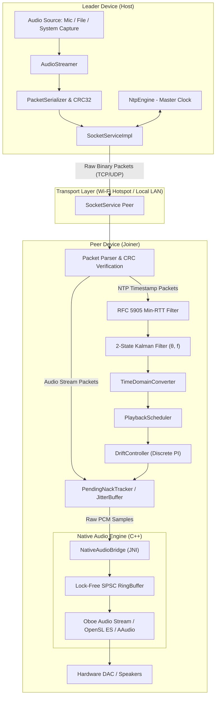

# 🎵 SyncItBaby (SyncCast)

<p align="center">
  
</p>

<p align="center">
  <strong>Sub-millisecond Synchronized Multi-Device Audio Streaming & Transfer for Android</strong>
</p>

<p align="center">
  <a href="https://kotlinlang.org/"></a>
  <a href="https://developer.android.com/jetpack/compose"></a>
  <a href="https://github.com/google/oboe"></a>
  <a href="https://developer.android.com/about/dashboards"></a>
  <a href="https://developer.android.com/about/versions/16"></a>
  <a href="LICENSE"></a>
</p>

---

## 📖 Overview

**SyncItBaby** turns multiple Android devices into a unified, high-precision distributed audio system over a local Wi-Fi hotspot or LAN. One device acts as the **Leader (Host)**, broadcasting audio streams or transferring media files to multiple connected **Peers (Clients)**, which play back the audio through their native speakers with sub-millisecond acoustic synchronization ($< 1\,\text{ms}$ phase alignment).

### Why SyncItBaby?
* **Zero Root / No Custom Hardware**: Operates entirely over standard Android APIs and Wi-Fi networks.
* **Overcomes Bluetooth A2DP Bottlenecks**: Standard Bluetooth A2DP is restricted to a single sink per device; SyncItBaby streams to an arbitrary number of client phones concurrently.
* **Hardware Clock Drift Compensation**: Continuous 2-State Kalman filtering and Snapcast-style discrete sample steering prevent acoustic phase drift between varying DAC crystal oscillators.
* **Native C++ Audio Pipeline**: Powered by Google's [Oboe](https://github.com/google/oboe) C++ audio library with lock-free Single-Producer Single-Consumer (SPSC) ring buffers for ultra-low latency.

---

## 📱 User Interface Showcase

| Role Selection | Host Screen (Normal Mode) | Host Screen (Developer Mode) |
| :---: | :---: | :---: |
|  |  |  |
| *Select between Leader (Host) and Peer (Join) modes* | *Session management, volume controls & peer list* | *Real-time telemetry, buffer health & packet diagnostics* |

<br />

| Join Screen (Peer) | Host Developer HUD | Settings & Audio Config |
| :---: | :---: | :---: |
|  |  |  |
| *Peer connection state, clock sync status & live jitter* | *Low-level network telemetry & DAC drift tracking* | *Fine-tune buffer sizes, sync intervals & audio modes* |

---

## ✨ Key Architectural Features

### ⏱️ 1. Sub-Millisecond Clock Synchronization
- **NTP-Grade Exchange**: High-frequency bidirectional timestamp exchange over raw UDP/TCP sockets.
- **RFC 5905 Min-RTT Filter**: 8-slot sliding window algorithm that rejects network jitter and asymmetric path spikes.
- **2-State Kalman Filter ($\mathbf{[\theta, f]}$)**: Continuously tracks clock offset ($\theta$) and frequency skew/drift rate ($f$), producing rock-solid master time estimation.
- **Popcorn Spike Suppression**: Statistical outlier rejection protects against sudden Wi-Fi scheduling delays.
- **Adaptive Polling Manager**: Dynamically backs off polling intervals from $5\,\text{s}$ to $60\,\text{s}$ once convergence is achieved to minimize power and bandwidth consumption.

### 🎧 2. High-Performance Audio Engine (C++ / Oboe)
- **Lock-Free SPSC Ring Buffer**: Implemented in C++ (`SpscRingBuffer.h`) to guarantee zero mutex contention or thread blocking on the real-time audio thread.
- **Direct JNI Bridge**: Direct low-overhead bridging (`NativeAudioBridge.cpp`) between Kotlin audio coroutines and native Oboe audio streams.
- **Fallback Engine**: Automatic graceful fallback to optimized Java `AudioTrack` if native Oboe initialization encounters hardware-specific constraints.

### 🔄 3. Discrete Sample Drift Correction
- **Snapcast-Inspired Steering**: Instead of resampling audio (which introduces audible DSP artifacts and phase distortion), the engine dynamically inserts or drops a single discrete PCM sample ($+1 / -1$ sample at $48\,\text{kHz} \approx 20.83\,\mu\text{s}$) inside the `JitterBuffer`.
- **Discrete PI Controller**: Continuously compares scheduled presentation timestamps against local DAC playout positions to modulate sample insertion/dropping seamlessly.

### 📡 4. Framed Binary Packet Protocol
- **Zero-Allocation Binary Framing**: Custom packet structure with magic header `0x53594E43` (`SYNC`), sequence numbering, 64-bit microsecond timestamps, and per-packet **CRC32** validation.
- **Selective NACK Retransmission**: BitSet-based packet loss tracking (`PendingNackTracker.kt`) requests missing audio chunks before playout deadlines.

### 🎙️ 5. Live Audio Capture & File Transfer
- **Live Playback Capture**: Captures internal device audio from media applications using Android 10+ `AudioPlaybackCaptureConfiguration`.
- **Chunked File Transfer**: SHA-256 validated chunked transport for sharing audio files prior to synchronized playback.

---

## 🏛️ System Architecture



### Module Structure

```
GreetingCard/
├── app/
│   ├── src/main/
│   │   ├── cpp/                                # Native C++ High-Performance Audio
│   │   │   ├── CMakeLists.txt                  # CMake build configuration
│   │   │   ├── NativeAudioBridge.cpp           # JNI bindings for Kotlin <-> C++
│   │   │   ├── OboeRenderer.cpp / .h           # Google Oboe real-time audio playback stream
│   │   │   └── SpscRingBuffer.h                # Lock-free single-producer single-consumer ring buffer
│   │   ├── java/com/example/greetingcard/
│   │   │   ├── audio/                          # Audio streaming, jitter buffers, drift correction
│   │   │   │   ├── AudioCaptureService.kt      # Foreground service for AudioPlaybackCapture
│   │   │   │   ├── AudioStreamer.kt            # Leader audio stream orchestrator
│   │   │   │   ├── AudioReceiver.kt            # Peer packet receiver & pipeline feeder
│   │   │   │   ├── JitterBuffer.kt             # Adaptive ring buffer with sample insertion/dropping
│   │   │   │   ├── DriftController.kt          # PI controller for phase drift adjustment
│   │   │   │   ├── OboeAudioRenderer.kt        # Kotlin wrapper for native C++ Oboe stream
│   │   │   │   └── TelemetryData.kt            # Performance metrics (RTT, drift, buffer fill)
│   │   │   ├── network/                        # TCP / UDP socket management & connection state
│   │   │   │   ├── ConnectionManager.kt        # Network lifecycle manager
│   │   │   │   └── SocketServiceImpl.kt        # Raw socket transport with hotspot lifecycle
│   │   │   ├── protocol/                       # Framed binary packet protocol
│   │   │   │   ├── Packet.kt                   # Packet data structure & types
│   │   │   │   ├── PacketHeader.kt             # 22-byte framed header specification
│   │   │   │   └── PacketSerializer.kt         # CRC32 validation & binary (de)serialization
│   │   │   ├── sync/                           # Precision clock synchronization
│   │   │   │   ├── NtpEngine.kt                # NTP packet exchange engine
│   │   │   │   ├── KalmanClockFilter.kt        # 2-State Kalman Filter implementation
│   │   │   │   ├── ClockFilterAlgorithm.kt     # RFC 5905 8-slot min-RTT filter
│   │   │   │   └── AdaptivePollManager.kt      # Dynamic polling interval manager
│   │   │   ├── ui/                             # Jetpack Compose Material 3 UI
│   │   │   │   ├── ModeSelectScreen.kt         # Role selector (Leader / Peer)
│   │   │   │   ├── HostScreen.kt               # Leader dashboard with developer telemetry HUD
│   │   │   │   ├── JoinScreen.kt               # Peer connection & status screen
│   │   │   │   └── SettingsScreen.kt           # Tuning parameters & diagnostic settings
│   │   │   └── viewmodel/                      # Architecture view models
│   │   └── AndroidManifest.xml
├── UI IMAGES/                                  # Application screenshots & UI mockups
├── gradle/
├── build.gradle.kts
└── settings.gradle.kts
```

---

## 📦 Binary Packet Protocol Specification

Every packet transmitted over the wire follows a strict 22-byte header binary layout followed by payload and CRC32 verification:

```
 0                   1                   2                   3
 0 1 2 3 4 5 6 7 8 9 0 1 2 3 4 5 6 7 8 9 0 1 2 3 4 5 6 7 8 9 0 1
+-+-+-+-+-+-+-+-+-+-+-+-+-+-+-+-+-+-+-+-+-+-+-+-+-+-+-+-+-+-+-+-+
|                  Magic Bytes (0x53594E43 "SYNC")              |
+-+-+-+-+-+-+-+-+-+-+-+-+-+-+-+-+-+-+-+-+-+-+-+-+-+-+-+-+-+-+-+-+
|          Packet Type          |          Flags / Reserved     |
+-+-+-+-+-+-+-+-+-+-+-+-+-+-+-+-+-+-+-+-+-+-+-+-+-+-+-+-+-+-+-+-+
|                        Payload Length (N)                     |
+-+-+-+-+-+-+-+-+-+-+-+-+-+-+-+-+-+-+-+-+-+-+-+-+-+-+-+-+-+-+-+-+
|                        Sequence Number                        |
+-+-+-+-+-+-+-+-+-+-+-+-+-+-+-+-+-+-+-+-+-+-+-+-+-+-+-+-+-+-+-+-+
|                                                               |
+                    Master Timestamp (64-bit μs)               +
|                                                               |
+-+-+-+-+-+-+-+-+-+-+-+-+-+-+-+-+-+-+-+-+-+-+-+-+-+-+-+-+-+-+-+-+
|                          Payload Data ...                     |
|                           (N Bytes)                           |
+-+-+-+-+-+-+-+-+-+-+-+-+-+-+-+-+-+-+-+-+-+-+-+-+-+-+-+-+-+-+-+-+
|                        CRC-32 Checksum                        |
+-+-+-+-+-+-+-+-+-+-+-+-+-+-+-+-+-+-+-+-+-+-+-+-+-+-+-+-+-+-+-+-+
```

### Supported Packet Types
| Type ID | Enum Name | Description |
| :--- | :--- | :--- |
| `0x0001` | `NTP_REQUEST` | Client request containing local client transmit timestamp $T_1$ |
| `0x0002` | `NTP_RESPONSE` | Master response containing $T_1$, receive timestamp $T_2$, and transmit timestamp $T_3$ |
| `0x0010` | `AUDIO_STREAM_CONFIG` | Audio format parameters (Sample rate, channels, encoding, frame size) |
| `0x0011` | `AUDIO_SYNC_START` | Synchronized future presentation start epoch |
| `0x0012` | `AUDIO_DATA` | Framed PCM/Opus audio chunk with scheduled presentation timestamp |
| `0x0013` | `AUDIO_NACK` | Selective retransmission request for missed audio sequence numbers |
| `0x0020` | `FILE_TRANSFER_HEADER` | File metadata, total length, chunk count, full-file SHA-256 |
| `0x0021` | `FILE_CHUNK_DATA` | Chunk payload with per-chunk SHA-256 verification |

---

## 🚀 Getting Started

### Prerequisites
- **Android Studio**: Android Studio Ladybug (2024.2.1+) or newer.
- **Android SDK**: Compile SDK 36, Target SDK 36, Min SDK 24 (Android 7.0+).
- **Android NDK**: Version `26.x` or newer with CMake `3.22.1+`.
- **JDK**: Java 11 or Java 17.

### Building from Source

```bash
# Clone the repository
git clone https://github.com/developerakshat12/SyncItBaby.git
cd SyncItBaby

# Build the Debug APK
./gradlew assembleDebug

# Run unit and synchronization tests
./gradlew testDebugUnitTest
```

### Running on Physical Devices
1. Install the APK on **at least two Android devices**.
2. **Device 1 (Host)**: Select **Host Mode**. The device will turn on a Local Wi-Fi Hotspot or host a socket server on your local Wi-Fi.
3. **Device 2+ (Peers)**: Connect to the Host's Wi-Fi network and select **Join Mode**. The devices will automatically initiate NTP clock synchronization.
4. **Start Stream**: Choose an audio source (Live System Capture, Test Tone, or Media File) and tap **Start Playback**.

---

## 🤝 Contributing & Pull Request Guidelines

We welcome contributions from the open-source community! To maintain strict code quality, sub-millisecond sync precision, and audio stability, please follow these guidelines when creating issues, Pull Requests (PRs), or Merge Requests (MRs).

### 🌿 1. Branching Strategy
- `main` — Production-ready, fully tested codebase.
- `develop` — Active development branch.
- Feature branches: `feat/<short-description>` (e.g., `feat/opus-compression`)
- Bugfix branches: `fix/<issue-description>` (e.g., `fix/hotspot-tear-down`)
- Performance branches: `perf/<optimization-area>` (e.g., `perf/spsc-cache-alignment`)

### 📝 2. Commit Message Standards (Conventional Commits)
Follow the [Conventional Commits](https://www.conventionalcommits.org/) specification:

```
<type>(<scope>): <short summary in imperative mood>

[optional body explaining rationale and trade-offs]

[optional footer with issue references, e.g., Closes #42]
```

**Allowed Types:**
- `feat`: A new feature or capability.
- `fix`: A bug fix.
- `perf`: Code change that improves performance or reduces audio latency.
- `refactor`: Code change that neither fixes a bug nor adds a feature.
- `test`: Adding missing tests or correcting existing tests.
- `docs`: Documentation only changes.
- `chore`: Changes to build process, Gradle, or auxiliary tools.

*Example:*
```
feat(audio): implement lock-free SPSC queue for native Oboe callback

Replaces mutex-protected ring buffer with a cache-line aligned single-producer
single-consumer atomic ring buffer in C++ to eliminate priority inversion.

Closes #18
```

### 📋 3. Pull Request / Merge Request Checklist
Before submitting a PR/MR, ensure your contribution meets every item on this checklist:

```markdown
### PR Submission Checklist
- [ ] **Builds Cleanly**: `./gradlew assembleDebug` compiles with 0 errors and 0 warnings.
- [ ] **Unit Tests Passed**: `./gradlew testDebugUnitTest` runs with all tests green.
- [ ] **No Audio Thread Locks**: Verified that no `synchronized`, `Mutex`, memory allocation (`malloc`/`new`), or I/O calls are placed on the real-time audio thread or C++ `onAudioReady` callback.
- [ ] **Memory & Allocation Check**: Zero object allocations inside hot loops (e.g. `onBufferReceived`, `AudioRenderer` render loops).
- [ ] **Formatting & Style**: Code follows official Kotlin and Android C++ coding conventions.
- [ ] **Documentation**: Updated `README.md` or architectural docs if introducing new protocols, configs, or packet types.
- [ ] **Screenshots / Logs Attached**: If changing the UI or telemetry HUD, attach before/after screenshots or telemetry logs.
```

### 🔍 4. Review Process
1. **All review process will be done by me** - 

---

## 📜 License

This project is licensed under the Apache License 2.0 - see the [LICENSE](LICENSE) file for details.

```
Copyright (c) 2026 SyncItBaby Contributors

Licensed under the Apache License, Version 2.0 (the "License");
you may not use this file except in compliance with the License.
You may obtain a copy of the License at

    http://www.apache.org/licenses/LICENSE-2.0
```

---

## 🌟 Acknowledgments
- [Google Oboe](https://github.com/google/oboe) for low-latency native Android audio.
- [Snapcast](https://github.com/badaix/snapcast) for inspiration regarding discrete sample drift steering mechanisms.
- [RFC 5905 (Network Time Protocol Version 4)](https://datatracker.ietf.org/doc/html/rfc5905) for clock filter algorithm references.
